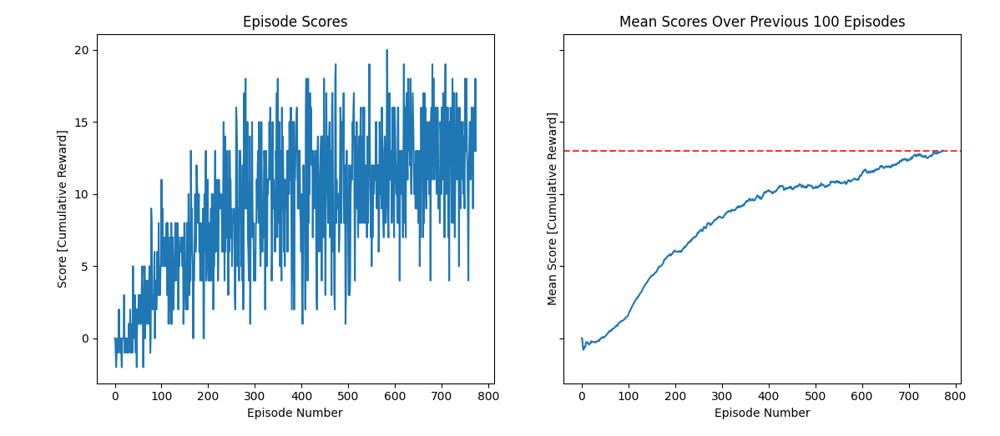

# Udacity Deep Reinforcement Learning Project 1 Report
Robert Griffith  
4 June 2021

## Project Description

The goal of this project was to use deep reinforcement learning algorithms to  
train an agent to navigate and collect bananas in a provided UnityEnvironment  
following the architecture of the open-source Unity plugin **Unity Machine  
Learning Agents (ML-Agents)**. The Banana Collector environment is provided  
by Udacity, and is a modified version of one of the environments in the  
ML-Agents [GitHub repository](https://github.com/Unity-Technologies/ml-agents).

The environment is relatively simple, with a continuous state with 37 dimensions  
and a discrete action space with 4 actions. Agents are provided a reward of +1  
for collecting a yellow banana while a blue banana yields a reward of -1. This  
task is episodic, and the environment is considered "solved" upon the agent  
earning an average score of +13 over 100 consecutive episodes.

In order to complete this project, not only does a deep reinforcement learning  
algorithm need to be implemented, but a myriad of hyperparameters, neural  
network model structures, and transition augmentations tailored to the Banana  
Collector environment need to be explored and implemented as well.

## Learning Algorithm - [Deep Q-Learning (Mnih et al., 2015)](https://www.cs.toronto.edu/~vmnih/docs/dqn.pdf)

To "solve" the afformentioned environment, I hypothesized that it was simple  
enough to solve using Deep Q-Learning at an even faster pace than shown as an  
example in the Udacity project description. There it was shown that the  
Udacity team's baseline Deep Q-Learning project solution could "solve" the  
environment in ~1800 episodes. 

In pursuit of this hypothosesis, I implemented the gradient step portion of the  
Deep Q-Learning algorithm as well as the epsilon-greedy action portion within  
the `DeepQ` class in `src/deepq.py`. The experience replay buffer used to store  
and randomly sample transitions by the algorithm is implemented within the  
`ReplayBuffer` class in `src/replay.py` using efficient random sampling and  
insertions afforded by numpy arrays.

To briefly summarize the Deep Q-Learning algorithm, the fundamental idea is to  
estimate the action-value function by using the Bellman equation in iterative  
updates. The optimal action-value function is denoted by _Q*(s,a)_, where *s*  
is a state and *a* is an action. The learned action-value function estimator  
*Q&theta;(s,a)* is parameterized by *&theta;*. In Deep Q-Learning, *Q&theta;(s,a)* is a neural network that  
learns to approximate _Q*_(*s,a*) through gradient descent updates to network  
weights/parameters *&theta;*. This neural network action-vaue approximator is  
referred to as a Q-network (`qnet` in the code). The Bellman equation  
_Q*_(*s,a*) = **E**s'[*r* + *&gamma;* max*a'* _Q*_(*s',a'*)] is used to produce that target optimal value of  
_Q*_(*s,a*) for a given "transition" (*s,a,r,t,s'*) (state, action, reward, next state) that  
encodes the information of an agent's experience of a given time step. The value  
_Q*_(*s',a'*) is estimated by a target delayed Q-network *Q&theta;'*(*s',a'*) (`target_qnet` in the  
code) that shares the same structure as *Q&theta;* but uses parameters *&theta;'* that are  
equal to a previous iteration of parameters *&theta;*. Through many simulations,  
transitions are collected in a replay buffer and randomly sampled to perform  
updates to the Q-network by minimizing the difference between *Q&theta;*(*s,a*) and the  
Bellman-equation-computed _Q*_(*s,a*) (using *Q&theta;'*(*s',a'*)) for all sampled transitions. This  
minimization is performed by computing the gradient of a selected loss function  
with respect to Q-network parameters *&theta;*. A simple example of such a loss function is  
"Mean-Squared-Error": &nbsp; **E***s,a,r,s'*(*Q&theta;*(*s,a*) - **E**s'[*r* + *&gamma;* max*a'* *Q&theta;'*(*s',a'*)])2. &nbsp;

My implementation of the replay buffer has slight modifications from the buffer  
in the paper, as a new transition is not guaranteed to be inserted if the  
buffer is full (it is logically inserted and then randomly selected to be removed  
so the buffer does not exceed its capacity). Similarly, when randomly sampling  
from the buffer, transitions are sampled with replacement. This allows early  
training iterations, performed upon a nearly empty replay buffer with transitions  
taken with many random actions, to have higher sample-efficiency and extract  
information from these more exploratory actions while they are still in the  
buffer and not unlikely to be sampled. The replay buffer capacity used is 1e6.

The gradient step implemented within `DeepQ` is exactly as defined within the  
paper; minimizing the exact same loss. The target action-value network  
(`target_qnet` in the code) is updated using polyak averaging however, where the  
network parameters *&theta;'* are updated as a weighted average of themselves and the  
parameters *&theta;* from the updating action-value network (`qnet` in the code). In the  
paper the target action-value network was instead updated by simply setting its  
parameters equal to those of a previous iteration of the updating action-value  
network. This change helps prevent the difference between the two action-value  
networks from approaching zero, as is possible if model updates are small and  
the target action-value network's parameters are updated frequently. The polyak  
factor *&tau;* used is 0.995, where *&theta;'* = *&tau;* * *&theta;'* + (1 - *&tau;*) * *&theta;*.

Two more small changes not specified in the Deep Q-Learning paper were made, one  
of which was to clamp transition rewards to fit within the range [-1, 1] during training  
so as to provide more regular reward inputs that simplify the optimal _Q*(s,a)_ that the  
training *Q&theta;* is training to approximate without changing which action the action-value  
function should learn to prefer for such transitions with clamped/clipped rewards. The  
other small change was to implement a form of *&epsilon;* "refreshing" that can occur once the  
minimum *&epsilon;* value is reached after annealing. *&epsilon;* is "refreshed" to the small value of  
0.05 (5% random actions) to encourage exploration and hopefully contribute to escaping  
the current local maxima. Once the minimum *&epsilon;* value, 0.01, is reached either originally  
or after refreshing, a maximum average score is maintained over the past 100 scores.  
If the agent is stuck in a local maxima and is unable to improve rewards for 100 episodes  
or if the agent's average score over the past 100 episodes is less than the current  
maximum average score by more than 0.5, then *&epsilon;* is refreshed in this way. This was a very  
useful feature when my hyperparameters were not tuned as well, however in my final  
training run I did not make use of this feature as none of the above conditions were ever  
met and the agent did not get stuck in a local maxima. The episode length of 100 used  
for these various hyperparameters concerning *&epsilon;* refreshing is chosen to match the length  
of the score window used to determine if the environment is solved to be analagous to  
the average score metric that we are primarily concerned with.

Hyperparameters used during training that have not been mentioned above are included  
here:
* *Q&theta;* learning rate: **0.0003** (small due to frequency of gradient steps)
* discount factor *&gamma;*: **1**
* (mini) batch size: **128** (chosen to be larger than in the Deep Q-Learning paper to help stability)
* *&epsilon;* max: **1.0**
* *&epsilon;* decay: **0.99** (*&epsilon;t+1* = 0.99 * *&epsilon;t*)
* *K* (number of simulation steps per algorithm step, see paper): **2**

The neural network architecture used for the Q-function *Q&theta;* (and *Q&theta;'*) is a sequential multilayer  
perceptron with layers only consisting of "linear" layers and ReLU activation layers.  
Each linear layer is comprised of parameters "weights" *w* and "biases" *b*, where  
given an input *i* the layer outputs _w*i + b_ where the weights and the input must  
match their final and first dimensions respectively, and the biases are added  
by an elementwise broadcast along the final dimensions of _w*i_. The layer order used  
is provided as follows:
* Linear layer with weights of shape (37, 128), biases of shape (128,)
* ReLU activation layer
* Linear layer with weights of shape (128, 128), biases of shape (128,)
* ReLU activation layer
* Linear layer with weights of shape (128, 4), biases of shape (4,)

## Plot of Rewards

## Ideas for Future Work

I am particularly interested in continuous actions reinforcement learning algorithms, and  
I have implemented Soft Actor Critic and applied it to my current work as an AI software  
engineer. It would be interesting to try to apply the learned temperature variable in the  
Soft Actor Critic algorithm to a discrete action algorithm like Deep Q-Learning or Vanilla  
Policy Gradient and see how they perform in a simple environment like this. I essentially  
tried to mimic the functionality of the temperature variable with my somewhat hacky *&epsilon;*  
"refreshing" implementation here.

I was also planning on implementing [Double Deep Q-Learning (van Hasselt et al., 2015)](https://arxiv.org/pdf/1509.06461.pdf)  
and potentially [Prioritized Experience Replay (Schaul et al., 2016)](https://arxiv.org/pdf/1511.05952.pdf) if for some reason I was  
to be unsuccesful in using only Deep Q-Learning. This need (thankfully) did not arise, so it  
remains as potential future work to at least compare the performance of each of these  
techniques.